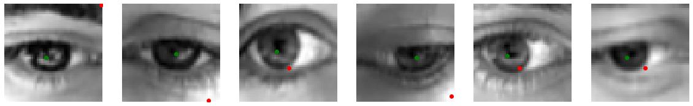

# Iris recognition 
The following CNN allows to predict the position of iris center of eyes.
## Neural network's architrcture
Fully convolutional neural network that consits of base network and auxiliary network. The loss of base network used to measure distance between predicted iris center and the ground truth, the reconstruction loss of auxiliary network used to preserve important positional features of image. Moreover, the neural network has a skip connection which allows to bring information to deep layers.

## Image processing
The images were cropped to (48, 48) shape regions with eye with use of labels which define the corners and irises of eyes.

 \
*(1) cropped eye (2) corresponding label*

## Result
The presented result was obtained with following hyperparameters:
- **Loss of base network:** MSE loss
- **Loss of auxiliary network:** MAE loss
- **Activation function**: RELU
- **Optimizer**: SGD
- **Number of epochs**: 100

## Refernces
**Data:** [Link](https://www.unavarra.es/gi4e/databases/gi4e/)

**Paper:** Choi, Jun & Lee, Kang & Kim, Young & Song, Byung. (2019). Accurate Eye Pupil Localization Using Heterogeneous CNN Models. 2179-2183. 10.1109/ICIP.2019.8803121. [Link](https://ieeexplore.ieee.org/abstract/document/8803121)
